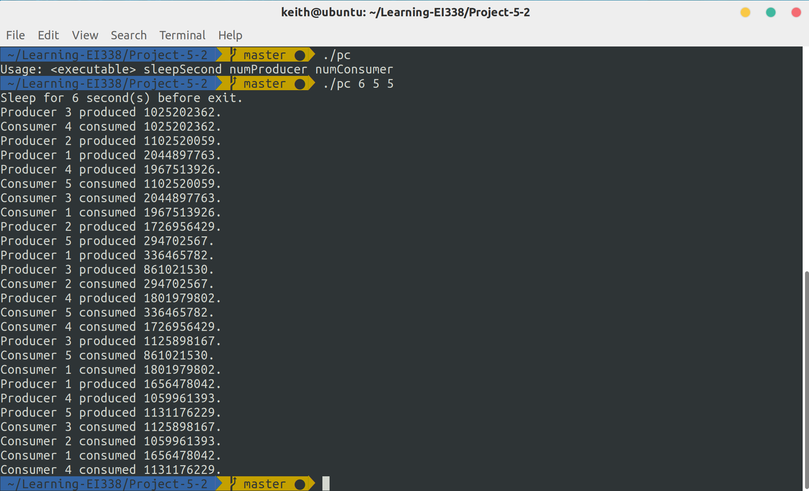

# Project 5-2: The Producer–Consumer Problem

The Producer–Consumer Problem. (Operating System Concepts, 10th Edition, Chapter 7)

## Description

This project involves using standard counting semaphores and a mutex lock to solve the producer-consumer problem.

## Environment

- OS: Ubuntu 18.04 (Linux kernel version: 5.3.5)
- Compiler: GCC 7.4.0

## Basic Ideas

According to the definition, a thread pool main supports two operations: initialization and submission. After initialization, when a task is submitted successfully to the pool, it will later be executed by some available thread in the pool.

## Details

### init and destroy

```c
// the buffer
buffer_item buffer[BUFFER_SIZE + 1];
size_t bufferHead, bufferTail;

// mutex and semaphore
sem_t full, empty;
pthread_mutex_t lock;

void init_buffer() {
    pthread_mutex_init(&lock, NULL);
    sem_init(&full, 0, 0);
    sem_init(&empty, 0, BUFFER_SIZE);
    bufferHead = bufferTail = 0;
}

void destroy_buffer() {
    sem_destroy(&empty);
    sem_destroy(&full);
    pthread_mutex_destroy(&lock);
}
```

### insert and remove items

Similar to the solution in the textbook, two semaphores are used when inserting and removing items.

```c
// insert item into buffer
// return 0 if successful, otherwise nonzero
int insert_item(buffer_item item) {
    sem_wait(&empty);
    pthread_mutex_lock(&lock);
    buffer[bufferTail] = item;
    bufferTail = (bufferTail + 1) % (BUFFER_SIZE + 1);
    pthread_mutex_unlock(&lock);
    sem_post(&full);
    return 0;
}

// remove an object from buffer and place it in item
// return 0 if successful, otherwise nonzero
int remove_item(buffer_item *item) {
    sem_wait(&full);
    pthread_mutex_lock(&lock);
    *item = buffer[bufferHead];
    bufferHead = (bufferHead + 1) % (BUFFER_SIZE + 1);
    pthread_mutex_unlock(&lock);
    sem_post(&empty);
    return 0;
}
```

### producer and consumer

The producer and consumer thread works forever, until it gets cancelled by the main thread. In each iteration, it sleeps for a while and then do the insertion or removal.

```c
void *producer(void *param) {
    buffer_item item;
    while (1) {
        // sleep for a random period of time
        sleep(rand() % MAX_SLEEP_TIME + 1);
        item = rand();
        if (insert_item(item)) {
            fprintf(stderr, "Error: failed to insert item.\n");
        } else {
            printf("Producer %i produced %d.\n", *(int *)param, item);
        }
    }
}

void *consumer(void *param) {
    buffer_item item;
    while (1) {
        // sleep for a random period of time
        sleep(rand() % MAX_SLEEP_TIME + 1);
        if (remove_item(&item)) {
            fprintf(stderr, "Error: failed to remove item.\n");
        } else {
            printf("Consumer %i consumed %d.\n", *(int *)param, item);
        }
    }
}
```

### the main thread

Basically, the main thread has six steps:

1. Get command line arguments `argv[1]`,`argv[2]`,`argv[3]`
2. Initialize buffer
3. Create producer thread(s)
4. Create consumer thread(s)
5. Sleep
6. Exit

```c
int main(int argc, char *argv[]) {
    /* 1. Get command line arguments argv[1],argv[2],argv[3] */
    if(argc != 4) {
        fprintf(stderr, "Usage: <executable> sleepSecond numProducer numConsumer\n" );
        return 0;
    }
    unsigned int sleepSecond = atoi(argv[1]);
    size_t numProducer = atoi(argv[2]), numConsumer = atoi(argv[3]);
    /* 2. Initialize buffer */
    init_buffer();
    /* 3. Create producer thread(s) */
    pthread_t *producers = malloc(numProducer * sizeof(pthread_t));
    int *producer_id = malloc(numProducer * sizeof(pthread_t));
    for(size_t i = 0 ; i != numProducer; ++i) {
        producer_id[i] = i + 1;
        pthread_create(&producers[i], NULL, producer, &producer_id[i]);
    }
    /* 4. Create consumer thread(s) */
    pthread_t *consumers = malloc(numConsumer * sizeof(pthread_t));
    int *consumer_id = malloc(numConsumer * sizeof(pthread_t));
    for(size_t i = 0; i != numConsumer; ++i) {
        consumer_id[i] = i + 1;
        pthread_create(&consumers[i], NULL, consumer, &consumer_id[i]);
    }
    /* 5. Sleep */
    printf("Sleep for %u second(s) before exit.\n", sleepSecond);
    sleep(sleepSecond);
    /* 6. Exit */
    for(size_t i = 0; i != numProducer; ++i) {
        pthread_cancel(producers[i]);
        pthread_join(producers[i], NULL);
    }
    sleep(3);   // a little time for consumers to consume left items
    for(size_t i = 0; i != numConsumer; ++i) {
        pthread_cancel(consumers[i]);
        pthread_join(consumers[i], NULL);
    }
    free(producers);
    free(producer_id);
    free(consumers);
    free(consumer_id);
    destroy_buffer();
    return 0;
}
```

## Result

Here's a demo of the thread pool:

```bash
$ ./pc
Usage: <executable> sleepSecond numProducer numConsumer
$ ./pc 6 5 5
Sleep for 6 second(s) before exit.
Producer 3 produced 1025202362.
Consumer 4 consumed 1025202362.
Producer 2 produced 1102520059.
Producer 1 produced 2044897763.
Producer 4 produced 1967513926.
Consumer 5 consumed 1102520059.
Consumer 3 consumed 2044897763.
Consumer 1 consumed 1967513926.
Producer 2 produced 1726956429.
Producer 5 produced 294702567.
Producer 1 produced 336465782.
Producer 3 produced 861021530.
Consumer 2 consumed 294702567.
Producer 4 produced 1801979802.
Consumer 5 consumed 336465782.
Consumer 4 consumed 1726956429.
Producer 3 produced 1125898167.
Consumer 5 consumed 861021530.
Consumer 1 consumed 1801979802.
Producer 1 produced 1656478042.
Producer 4 produced 1059961393.
Producer 5 produced 1131176229.
Consumer 3 consumed 1125898167.
Consumer 2 consumed 1059961393.
Consumer 1 consumed 1656478042.
Consumer 4 consumed 1131176229.
```

And the screenshot:


